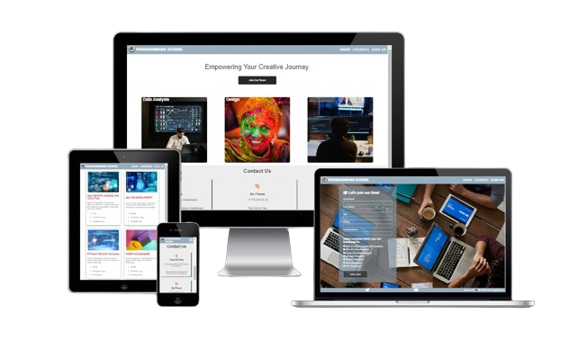
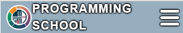

# Programming School

Programming School is a website designed to assist potential students in obtaining information about courses they can enroll in. It provides details about course prices, duration, and the skills that can be acquired during the courses. The target audience includes university students seeking additional knowledge in programming languages such as C++, JavaScript, and others. Additionally, individuals looking to transition into a new profession can also benefit from our offerings.

The site can be accessed by this [link](https://bogdanovaiv.github.io/programming-school/)

## User Stories

__First Time Visitors To The Site__

 - As a new visitor, I want to quickly understand what this website offers so that I can decide if it is worth staying on.
 - As a new visitor, I want to figure out information about available courses and their characteristics to decide on signing up.
 - As a new visitor, I want to easily find the contact section or the contact form to get answers to my questions.

__Returning Or Regular Visitors__

 - As a returning or regular user, I want to quickly find information about new courses and updates to stay up to date with the latest events.
 - As a returning or regular user, I want to quickly navigate to sign up form, if I have already decided which course I want.

## Features

### Existing Features

__Navigation Bar__

 - This section contains image logo and links: the Logo, the "Home" page, the "Courses" page and the "Sign Up" page.
 - The navigation allows the user to easily get targets without having to revert back to the previous page via the ‘back’ button.
  
  

 - Links have a hover effect: changing color.

  

 - The navigation bar represents a button on a smart phone.

 
         
  When pressed, the navigation drops down.

  

__The Footer__

 - The footer section includes links to the relevant social media sites for Programming School. The links will open in a new tab to allow easy navigation for the user.
 - The footer has information about the author and the date of creation.

 

 - Links have a hover effect: changing color.

 

__The Home Page__

 - The page has a section with a tagline and a button which opens the "Sign Up" page. It attracts a user's attention and allows them to move quickly. Also, the button has a hover effect and changes the color.

 
 
  When hovered, the button changes color.

  
 
 - The page includes information about the types of courses and has hovering animation. A number of image's columns depend on screen size. It is one or three columns. When arranged it one column, the section has detailed information about courses right away.

 

  When hovered over, the icon changes the image and adds detail course information.

  
 
 - The page has the contact section where the user can find contact information. The number of contact columns depends on screen size. It is one or three columns.

 

__The Courses Page__

- The page provides detail information about courses which includes skills, price, durations and available courses. The number of cards depends on screen size. It is one or more columns.

 

__The Sign Up Page__

 - The page allows the user to join the course. The user can write personal information and check several courses. First name, Last name and Email are required. The form has a hover effect.

 

  When hovered over, the text field adds a box-shadow.

  

  When hovered over, the checkbox displays a box-shadow and the label displays a text-shadow.

  

  When hovered, the button changes color.

  

  When pressed, the button opens a new page with information about receiving the application. The page refreshes automatically to The "Home" page in 15 seconds. 

  

## Technologies Used

- HTML5 - There are different elements, attributes and meta tags to structure content and optimize web pages for search engines. 
- CSS3 - It is used to style elements and create page layout, for animation and responsive design.
- Font Awesome - It is used to paste icons, improve appearance and for web-page functionality. 

## Design

## Color Scheme
  

  - Soft shade of blue is used for the background of the navigation bar and the footer. It adds calmness and professionalism.
  - Grey-blue color is applied to font-color and other details. It creates contrast and provides good readability.
  - White is used for the background of some sections and font-color. It creates a bright and open atmosphere, makes content more expressive and improves visual user experience.

## Typography

Font YSText is used for text content as first priority, which provides clarity and ease of perception and makes the text convenient to read. If YSText is unavailable, a browser will use Helvetica, then Arial, and finally standard Sans Serif to provide capability of a wide range of devices and OS.

## Testing

Please refer to the [TESTING.md](TESTING.md) file for all test-related documentation.

## Deployment

 - The site was deployed to GitHub pages. The steps to deploy are as follows: 
 - In the GitHub repository, navigate to the Settings tab 
 - From the source section drop-down menu, select the Master Branch
 - Once the master branch has been selected, the page will be automatically refreshed with a detailed ribbon display to indicate the successful deployment. 

The live link can be found [here](https://bogdanovaiv.github.io/programming-school/)

## Local Deployment

To deploy the project locally, clone the repository. You can do this by running the following command in your terminal:

`git clone https://github.com/BogdanovaIV/programming-school.git`

## Future Improvements

 - Send an automatic email with a thanks-you message.
 - Add more detailed information about courses.
 - Add a review feature.

## Credits 

### Content 

- The text was taken from free sources like Wikipedia
- The icons in the footer were taken from [Font Awesome](https://fontawesome.com/)

### Media

- The photos used on all page are from [This Open Source site](https://pxhere.com)

### Acknowledgments

- [Juliia Konovalova](https://github.com/IuliiaKonovalova/) was a great mentor which helped me to reveal my abilities and gave valuable advices.
- [Code Institute team](https://codeinstitute.net/) supported me and provided all the information which I needed.
- [Github](https://github.com/) provided free access to a versioning system.
- [ILoveImg](https://www.iloveimg.com/) provided a free services to compress images.