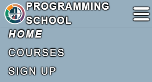
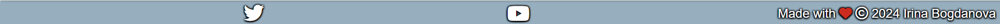
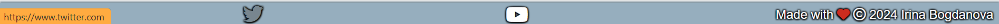

# Programming School

Programming School is a website designed to assist potential students in obtaining information about courses they can enroll in. It provides details about course prices, durations, and the skills that can be acquired during the courses. The target audience includes university students seeking additional knowledge in programming languages such as C++, JavaScript, and others. Additionally, individuals looking to transition into a new profession can also benefit from our offerings.

The site can be accessed by this [link](https://bogdanovaiv.github.io/programming-school/)

## Features

### Existing Features

- __Navigation Bar__

  - This section contains image logo and links: the Logo, Home page, Courses and Sign Up.
  - The navigation allow the user to easily get targets without having to revert back to the previous page via the ‘back’ button.
  
   

  - Links have hover effect: text-shadow.

   

  - The navigation bar represents a button on smart phone.

  
         
    When pressed, the navigation expands.

    

 __The Footer__

 - The footer section includes links to the relevant social media sites for Programming School. The links will open to a new tab to allow easy navigation for the user.
 - The footer has information about the author and date of creation.

 

 - Links have hover effect: text-shadow.

 

__The Home Page__

 - The page has a section with tagline and a button which opens Sigh up page. It attracts user's attention and allows to move quickly. Also, the button has hover effect and change the color.

 
 When hovered the button, it changes the color.

 
 
 - The page includes information about types of courses and has hovered animation. A number of image's columns depends on screen size. It is one or three columns. When one column, the section has detail information about courses in advance.

 When hovered the image, it changes the image and add detail course's information.

 
 
 - The page has the contact section where the user can find contact information. A number of contact columns depends on screen size. It is one or three columns.

 

__The Courses Page__

- The page provides detail information about courses which includes skills, prices, durations and available. A number of cards depends on screen size. It is one or more columns.

 

__The Sign Up Page__

 - The page allows the user to join the course. The user can write personal information and check several courses. First name, Second name and Email are required for fill. The form has hover effect.

 

 When hovered the text field, it adds box-shadow.

 

 When hovered the checkbox, it adds box-shadow on the checkbox and text-shadow on the label.

 

When hovered the button, it changes the color of the button.

When pressed the button, it opens new page with information about receiving the application.

