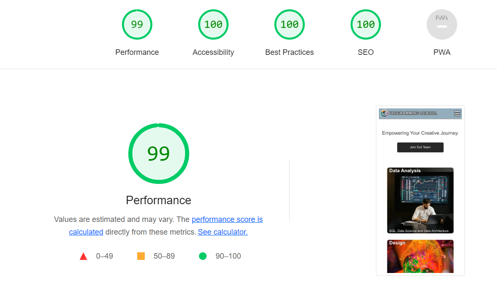
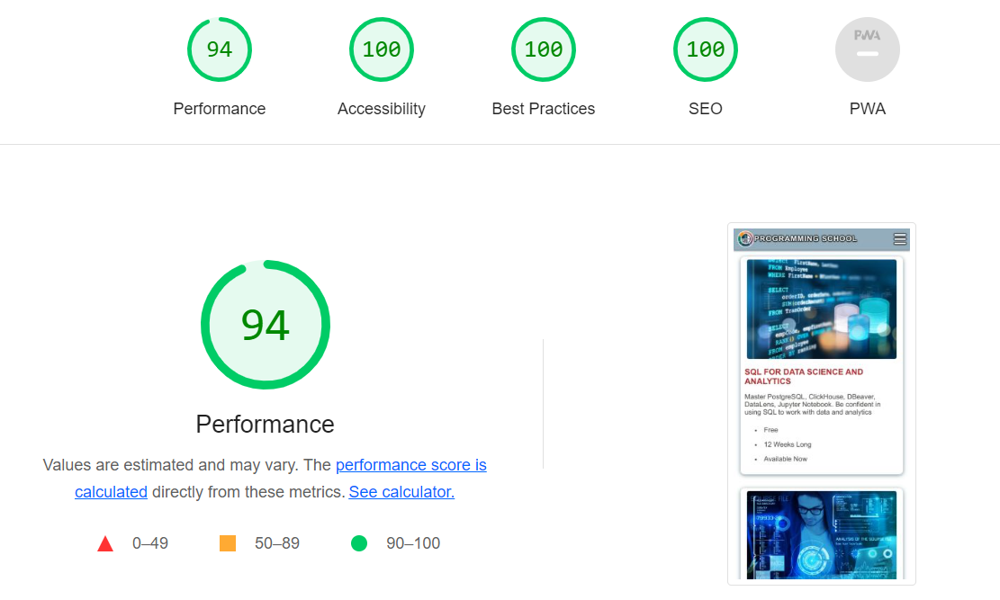
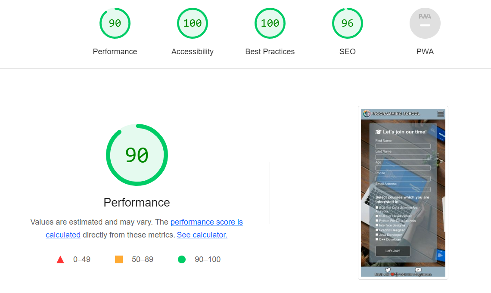

## TESTING

### Purpose Of Testing

Making sure the website works and the quality is high level, so that it provides ease of use and positive experience for the user.

### Testing Areas

__Functional Testing__

The opening of all pages and the correct operation of all links and buttons were tested. The navigation functions properly and the "Sign up" form sends the right information and checks the required fields.

| feature | action | expected result | tested | passed | comments |
| --- | --- | --- | --- | --- | --- |
| The Navbar | | | | | |
| Title "Programming school" | Click on the "Programming school" link | the "Home" page opens | Yes | Yes | - |
| Title "Programming school" is hovered over on large devices| Hover over the "Programming school" link | The link changes color | Yes | Yes | - |
| The "Home" link | Click on the "Home" link | the "Home" page opens | Yes | Yes | - |
| The "Home" link is hovered over on large devices | Hover over the "Home" link | The link changes color | Yes | Yes | - |
| The "Courses" link | Click on the "Courses" link | The "Courses" page opens | Yes | Yes | - |
| The "Courses" link is hovered over on large devices | Hover over the "Courses" link | The link changes color | Yes | Yes | - |
| The "Sign up" link | Click on the "Sign up" link | The "Sign up" page opens | Yes | Yes | - |
| The "Sign up" link is hovered over on large devices | Hover over the "Sign up" link | The link changes color | Yes | Yes | - |
| The Footer | | | | | |
| The "Twitter" icon | Click on the The "Twitter" icon | The "Twitter" page opens | Yes | Yes | - |
| The "Twitter" icon is hovered over on large devices | Hover over the "Twitter" icon | The icon changes color | Yes | Yes | - |
| The "YouTube" icon | Click on the "YouTube" icon | The "YouTube" page opens | Yes | Yes | - |
| The "YouTube" icon is hovered over on large devices | Hover over the "YouTube" icon | The icon changes color | Yes | Yes | - |
| The "Home" page | | | | | |
| "Join our team" button | Click on the "Join our team" button | The "Sign up" page opens | Yes | Yes | - |
| "Join our team" button is hovered over on large devices | Hover over the "Join our team" button | The button changes color | Yes | Yes | - |
| The "type-courses" section |  The "type-courses" section changes the number of columns depending on screen size | One colum on phones, three on other devices | Yes | Yes | - |
| The "type-courses" section is hovered over on large devices | Hover over "type-courses" section | The image of div changes and detailed information appears. | Yes | Yes | - |
| The "contact-us" section |  The "contact-us" section changes the number of columns by depending on screen size | One column on phones, three on other devices | Yes | Yes | - |
| The "Courses" page | | | | | |
| The "courses-items" section |  The "courses-items" section changes the number of columns depending on screen size | Different columns on different devices | Yes | Yes | - |
| The "Sign up" page | | | | | |
| First name input | Enter first name | First name is entered | Yes | Yes | - |
| First name input is hovered over on large devices | Hover over The "first name" field | A text shadow appears around the field | Yes | Yes | - |
| Last name input | Enter last name | Last name is entered | Yes | Yes | - |
| Last name input is hovered over on large devices | Hover over The "Last name" field | A text shadow appears around the field | Yes | Yes | - |
| Age input | Enter the age | The age is entered and is digital | Yes | Yes | - |
| Age input is hovered over on large devices | Hover over The "Age" field | A text shadow appears around the field | Yes | Yes | - |
| Phone input | Enter the phone | The phone is entered and is digital and/or "+"
 sign | Yes | Yes | - |
| Phone input is hovered over on large devices | Hover over The "Phone" field | A text shadow appears around the field | Yes | Yes | - |
| Email input | Enter the email | The email is entered | Yes | Yes | - |
| Email input is hovered over on large devices | Hover over the "Email" field | A text shadow appears around the field | Yes | Yes | - |
| Checkboxes input | Click the checkbox | The checkbox is marked | Yes | Yes | - |
| Checkboxes is hovered over on large devices | Hover over checkboxes | The checkbox and label get a text-shadow | Yes | Yes | - |
| "Submit" button | Click on the "Submit" button | The "First name" field, the "Last name" field and the "Email" field are checked. If there are no errors, the "Submit-form" page will open | Yes | Yes | - |
| "Submit" button is hovered over on large devices | Hover over "Submit" button | The button changes color | Yes | Yes | - |
| The "Submit-form" page | | | | | |
| Automatic redirection | The "Home" page opens automatically in 15 seconds |  The "Home" page opens automatically in 15 seconds | Yes | Yes | - |

__User Interface Testing__

The showing objects on different devices were tested. Those look attractive and display properly.

__Compatibility Testing__

The website was tested on different browsers such as Chrome, FireFox, Microsoft Edge. All objects function properly and display correctly. 

 - Chrome

  

 - FireFox

  

- Microsoft Edge

  

__Performance Testing__

Performance checking was tested by LightHouse.

  The "Home" page:

  

  The "Courses" page:

  

  The "Sign up" page:

  

__Code Quality__

Quality checking was tested by [Markup validator service](https://validator.w3.org/) and [CSS validator service](https://jigsaw.w3.org/css-validator/).

 - [Markup validator service](https://validator.w3.org/). All pages were checked and did not have errors and warnings.

 

 - [CSS validator service](https://jigsaw.w3.org/css-validator/). The file 'style.css' was checked and did not have errors.

 

## Bugs

__Solved Bugs__

 - Elements of the "Courses" page were not centered.
   Solution: Added property 'justify-content: center' in courses-items.
 - Pages loaded slowly.
   Solution: compressed images.
 - The label of the checkbox on the "Sign up" page did not highlight when the checkbox was hovered over.
   Solution: Added style for .checkbox-shadow:hover+.text-shadow 
   
__Unsolved Bugs__

 - None.

__Mistakes__

 - Using different formats of 'Commit' comments.
 - Some grammar and spelling mistakes.