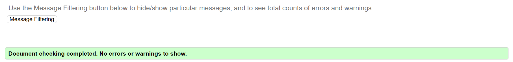
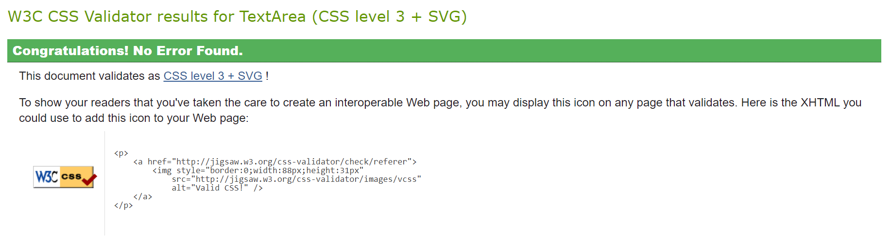
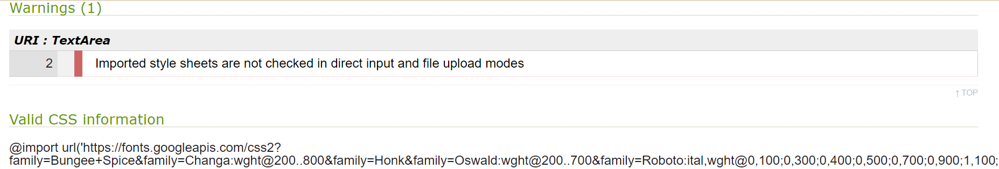

## TESTING

### Purpose Of Testing

Making sure the website works and the quality is high level, so that it provides ease of use and positive experience for the user.

### Testing Areas

__Functional Testing__

The opening of all pages and the correct operation of all links and buttons were tested. The navigation functions properly and the Sign up form sends right information and checks required fields.

__User Interface Testing__

The showing objects on different devices were tested. Those look attractive and display properly.

__Compatibility Testing__

The website was tested on different browsers such as Chrome, FireFox, Microsoft Edge. All objects function properly and display correctly. 

__Performance Testing__

Performance checking was tested by LightHouse

__Code Quality__

Quality checking was tested by [Markup validator service](https://validator.w3.org/) and [CSS validator service](https://jigsaw.w3.org/css-validator/).

 - [Markup validator service](https://validator.w3.org/). All pages were checked and did not have errors and warnings.

 

 - [CSS validator service](https://jigsaw.w3.org/css-validator/). The file 'style.css' was checked and did not have errors.

 
  
  It has only one warning which has not an impact on working and performance.
 

## Bugs

__Solved Bugs__

__Unsolved Bugs__

 - None.

__Mistakes__

 - Using different formats comments of commit.
 - Few mistakes of grammar and spelling.